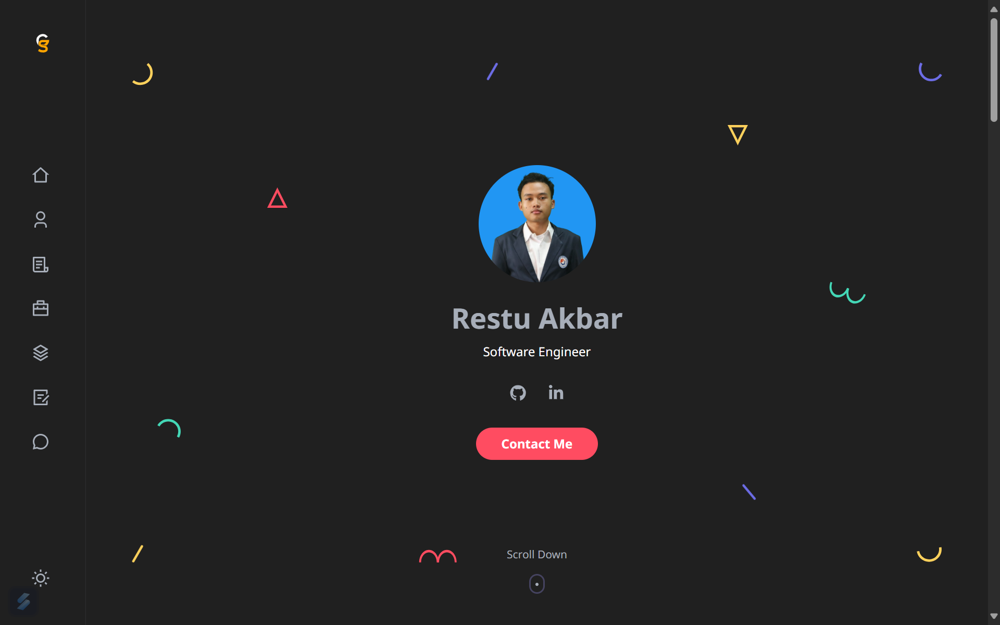

<h1 align="center">
  <br>
  
  <br>
  Restu Akbar's Personal Website
  <br>
</h1>

<h4 align="center">Personal portfolio website <a href="https://restu-akbar.github.io" target="_blank">Restu Akbar</a>.</h4>

<br>

## Development

Run the portfolio locally with Docker Compose:

```sh
make up
```
